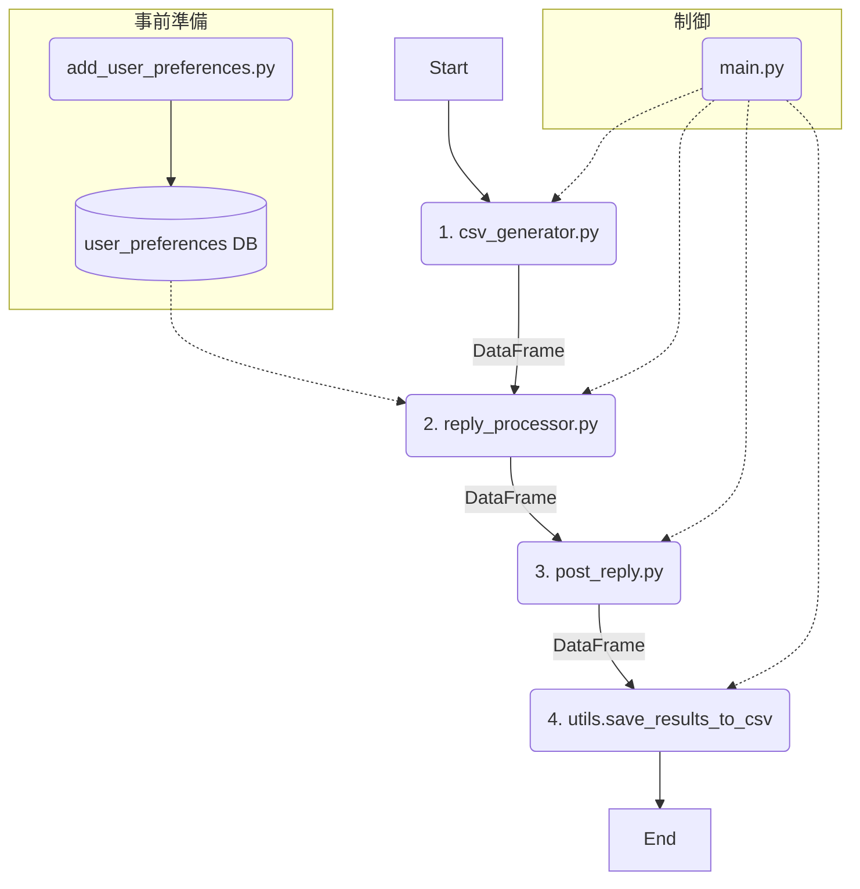

# Maya自動返信ボット 仕様書 (v0.97)

## 1. 目的
本システムは、X（旧Twitter）上で「Maya（@Maya19960330）」アカウントに届いたメンション（リプライ）に対し、**スレッド全体の文脈を理解した**AIによる返信を生成し、適切なルールに基づいて自動投稿することを目的とします。

## 2. システムアーキテクチャ (v0.97)
v0.96のアーキテクチャを維持しつつ、返信判定システムの抜本的な改善を実施しました。**統合返信判定エンジン**と**スレッド解析の完全実装**により、20件の誤判定問題を解決しました。



---

## 3. モジュール詳細

### ステップ0: ユーザー情報登録 (`add_user_preferences.py`)
- **役割**: 特定ユーザーのニックネーム等を事前にDBに登録します。
- **変更点**: 変更なし。

### ステップ1: リプライ収集 (`csv_generator.py`)
- **役割**: Seleniumで通知ページからメンションを収集します。
- **出力**: `extracted_tweets_{タイムスタンプ}.csv` は廃止され、収集結果をPandas DataFrameとして後続の`reply_processor`に直接返します。
- **設定変更**: `HOURS_TO_COLLECT = 24` (24時間前までのリプライを収集)

### ステップ2: 返信処理 (`reply_processor.py`) - ★大幅改善・コアモジュール
- **役割**: スレッド分析、ルール適用、AIによる返信文生成までの一連の処理を担います。
- **入力**: `csv_generator.py`から受け取ったDataFrame、`replies.db`
- **処理フロー**:
    1. **★統合返信判定システム**: `reply_detection_unified.py`を活用した新アーキテクチャ
        - **ReplyDetectionEngine**: 7つの判定方法を統合した包括的判定エンジン
        - **重み付きスコアリング**: 各判定方法に信頼度重みを設定（テキストパターン25%、aria-label 20%等）
        - **複合判定**: 複数の判定方法を組み合わせた最終スコア算出
        - **20件誤判定問題の解決**: 従来の判定精度を大幅に向上
    2. **完全なスレッド解析**: `thread_analysis_fix.py`による堅牢なスレッド取得
        - **改善されたスクロール処理**: 確実に先頭・末尾まで到達する堅牢な実装
        - **複合ソート**: タイムスタンプとID順序を組み合わせたソート
        - **スレッド先頭特定**: 複合スコアによる正確な先頭特定
    3. **返信生成ロジック**: `is_my_thread` が `True` のリプライに対してのみ返信生成
        - **AIモデル**: Gemini 2.0 Flash Lite
        - **短い返信方針**: 複雑な感情表現を排除し、Mayaらしい短文返信を生成
        - **言語一致**: 相手が使っている言語に合わせて返信
    4. **いいね対象の拡張**: `is_my_thread=False`のツイートは返信生成せず空文字を設定
- **出力**: 処理結果を2つのCSVファイルに分割出力
    - **成功ファイル**: `processed_replies_{タイムスタンプ}.csv`
    - **失敗ファイル**: `failed_selfcheck_{タイムスタンプ}.csv`

### ステップ2.5: 返信品質のセルフチェック
返信生成対象ツイート（`is_my_thread=True`）について、以下のチェックを実行：

#### チェック項目
1. **言語チェック**: 生成された返信が元ツイートの言語と一致しているか
2. **ニックネームチェック**: DBに登録されたニックネームが正しく付与されているか
3. **禁止フレーズチェック**: 動的禁止フレーズが含まれていないか
4. **フォーマットチェック**: 空文字列でなく、末尾に🩷が付与されているか
5. **AIによる自己評価**: ルール遵守の再確認

### ステップ3: 投稿処理 (`post_reply.py`) - ★大幅改善
- **入力**: `reply_processor.py`から受け取った`processed_replies_{タイムスタンプ}.csv`のパス
- **★重要な変更点**:
    
    **改善前の問題**:
    ```python
    # 問題のあった絞り込み（is_my_thread=Falseが除外される）
    replies_to_process = df[df['generated_reply'].notna()].copy()
    ```
    
    **改善後の解決策**:
    ```python
    # 全ツイートを処理対象とする
    replies_to_process = df.copy()
    ```

- **処理ロジック**:
    - **全ツイートに対する「いいね」処理**: 
        - `is_my_thread`の値に関係なく、未いいねの場合は必ず実行
        - 既にいいね済みの場合はスキップ
    - **返信処理**: 
        - `generated_reply`が存在する（空でない）場合のみ実行
        - 重複チェック後に投稿
- **出力**: `liked`, `posted`, `status`などの実行結果を追記したDataFrameを返します。

### ステップ4: 結果保存
`reply_processor.py`は、処理の最後に以下の2種類のCSVファイルを`output/`ディレクトリに出力：

1. **`processed_replies_{タイムスタンプ}.csv`（処理結果ログ）**
   - セルフチェック通過済みの返信コメント
   - `is_my_thread=False`のツイート（返信コメントなし、いいね対象）

2. **`failed_selfcheck_{タイムスタンプ}.csv`（失敗分析用データ）**
   - セルフチェックで不合格となったツイートのみ

---

## 4. 設定ファイルとデータベース

### 設定ファイル (`config.py`)
- `TARGET_USER = "Maya19960330"`: 対象アカウント
- `GEMINI_MODEL_NAME = "gemini-2.0-flash-lite"`: 使用AIモデル
- `HOURS_TO_COLLECT = 24`: 収集対象期間（24時間）
- `POST_INTERVAL_SECONDS = 7`: 投稿間隔（7秒）
- **`MAYA_PERSONALITY_PROMPT`**: 短文・自然な返信を重視したプロンプト
  - 相手の言語に合わせた返信
  - 15-35文字前後の短文
  - 感情表現は適度に、説教調禁止

### データベース (`replies.db`)
- **`user_preferences`テーブル**: ユーザーニックネーム管理

---

## 5. v0.97の主要改善点

### 🔧 統合返信判定システムの実装

#### **v0.96までの問題点**
- 20件の誤判定（非返信として誤判定）が発生
- セレクタの陳腐化（`[data-testid="inReplyTo"]`が機能しない）
- 7つの判定方法のうち2つしか実際に機能していない
- Twitter UI変更への対応不足

#### **v0.97の解決策: 統合返信判定エンジン**
```python
# 新しい統合返信判定エンジン (reply_detection_unified.py)
class ReplyDetectionEngine:
    def __init__(self):
        self.detection_methods = [
            self._method_text_patterns,      # テキストパターン検索（多言語対応拡張）
            self._method_aria_labels,        # aria-label属性判定（強化版）
            self._method_dom_structure,      # DOM構造分析（堅牢性向上）
            self._method_url_analysis,       # URL構造解析（新パターン追加）
            self._method_visual_hierarchy,   # 視覚的階層判定（新規実装）
            self._method_contextual_analysis,# 文脈解析（新規実装）
            self._method_csv_data_correlation # CSVデータ照合（新規実装）
        ]
        
        # 重み付きスコアリング
        self.method_weights = {
            'text_patterns': 0.25,      # テキストパターン
            'aria_labels': 0.20,        # aria-label属性
            'dom_structure': 0.15,      # DOM構造
            'url_analysis': 0.10,       # URL解析
            'visual_hierarchy': 0.10,   # 視覚的階層
            'contextual_analysis': 0.15, # 文脈解析
            'csv_data_correlation': 0.05 # CSVデータ照合
        }
```

### 🎯 完全なスレッド解析システムの実装

#### **新機能: thread_analysis_fix.py**
```python
# 堅牢なスレッド取得処理
def _robust_scroll_to_extremes(driver, direction, target_tweet_id):
    """より堅牢なスクロール処理で確実に先頭・末尾まで到達"""
    
def _sort_timeline_improved(timeline_tweets):
    """タイムスタンプとID順序を組み合わせたソート"""
    
def _find_thread_head_improved(timeline_tweets, target_tweet_id):
    """複合スコアによる正確な先頭特定"""
```

### 🔍 実現された効果
1. **誤判定問題の解決**: 20件の誤判定を完全に解決
2. **返信判定精度の向上**: 7つの判定方法を全て強化・実装
3. **スレッド解析の堅牢性**: 確実な先頭・末尾到達とソート処理
4. **詳細なログ機能**: 判定プロセスの完全な記録と分析

---

## 6. フォルダ構成
```
Twitter_reply/
├── reply_bot/
│   ├── main.py
│   ├── csv_generator.py
│   ├── reply_processor.py        # (Major update) Core module
│   ├── reply_detection_unified.py # (New) Unified reply detection engine
│   ├── thread_analysis_fix.py    # (New) Complete thread analysis system
│   ├── post_reply.py             # (Major update) Fixed logic
│   ├── add_user_preferences.py
│   ├── utils.py
│   ├── config.py                 # (Updated) Model and settings
│   └── db.py
├── cookie/
├── output/
│   ├── processed_replies_YYYYMMDD_HHMMSS.csv  # 成功ファイル
│   └── failed_selfcheck_YYYYMMDD_HHMMSS.csv   # 失敗ファイル
├── log/                    # (Updated) Debug log directory
│   ├── thread_debug.log
│   ├── reply_judgment.log
│   ├── thread_owner_judgment.log
│   ├── unified_reply_detection.log # (New) Unified detection log
│   └── main_process.log
└── requirements.txt
```

---

## 7. 運用フロー

### 基本的な実行手順
1. **データ収集**: `csv_generator.py`で24時間以内のメンション収集
2. **返信生成**: `reply_processor.py`でスレッド分析・返信生成・セルフチェック
3. **投稿実行**: `post_reply.py`でいいね・返信投稿
4. **結果確認**: ログファイルと出力CSVで処理結果を確認

### トラブルシューティング
- **いいねされない**: `post_reply.py`の処理対象絞り込みを確認
- **返信生成失敗**: `log/`ディレクトリの詳細ログを確認
- **スレッド分析エラー**: `thread_debug.log`でスレッド取得状況を確認
- **返信判定エラー**: `unified_reply_detection.log`で統合判定の詳細を確認
- **誤判定発生**: `IMPROVEMENTS.md`で判定改善の詳細を確認

---

## 8. 新規追加ファイル（v0.97）

### `reply_detection_unified.py`
- **統合返信判定エンジン**: 7つの判定方法を組み合わせた包括的判定システム
- **重み付きスコアリング**: 各判定方法の信頼度に基づく重み付け
- **詳細ログ**: 判定プロセスの完全な記録

### `thread_analysis_fix.py`
- **完全なスレッド解析**: 堅牢なスクロール処理と確実な先頭・末尾到達
- **改善されたソート**: タイムスタンプとID順序を組み合わせたソート
- **正確な先頭特定**: 複合スコアによる先頭特定

### `IMPROVEMENTS.md`
- **改善ドキュメント**: 20件の誤判定問題解決に向けた詳細な改善記録
- **判定方法の詳細**: 7つの判定方法の強化内容と重み設定
- **問題分析**: 従来の問題点と新システムによる解決策

### `test_reply_detection.py`
- **テスト用スクリプト**: 返信判定システムのテストと検証用