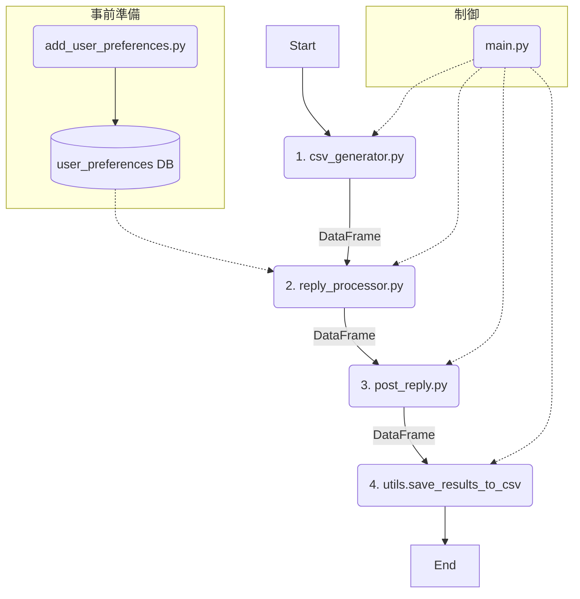

# Maya自動返信ボット 仕様書 (v0.94)

## 1. 目的
本システムは、X（旧Twitter）上で「Maya（@nyukimi_AI）」アカウントに届いたメンション（リプライ）に対し、**スレッド全体の文脈を理解した**AIによる返信を生成し、適切なルールに基づいて自動投稿することを目的とします。

## 2. システムアーキテクチャ (v0.94)
v0.8のパイプラインアーキテクチャを廃止し、`main.py`が各モジュールを順次呼び出し、処理結果をPandas DataFrameとしてメモリ上で引き渡す、よりシンプルで効率的な構造に変更されました。システムの核となるロジックは`reply_processor.py`に集約されています。



---

## 3. モジュール詳細

### ステップ0: ユーザー情報登録 (`add_user_preferences.py`)
- **役割**: 特定ユーザーのニックネーム等を事前にDBに登録します。
- **変更点**: 変更なし。

### ステップ1: リプライ収集 (`csv_generator.py`)
- **役割**: Seleniumで通知ページからメンションを収集します。
- **出力**: `extracted_tweets_{タイムスタンプ}.csv` は廃止され、収集結果をPandas DataFrameとして後続の`reply_processor`に直接返します。

### ステップ2: 返信処理 (`reply_processor.py`) - ★新設・コアモジュール
- **役割**: スレッド分析、ルール適用、AIによる返信文生成までの一連の処理を担います。`thread_checker.py`と`gen_reply.py`の機能を統合・拡張したものです。
- **入力**: `csv_generator.py`から受け取ったDataFrame、`replies.db`
- **処理フロー**:
    1. **スレッド情報取得**: DataFrameの各行（リプライ）について、Seleniumでツイートページを開き、スレッド全体の会話履歴を取得します。
    2. **スレッド起点判定**: スレッドの最初の投稿者が自分自身 (`TARGET_USER`) かを判定し、`is_my_thread` (True/False) をDataFrameに追加します。
    3. **返信生成ロジック**: `is_my_thread` が `True` のリプライに対して、以下の優先順位で返信を決定します。
        1. **短い挨拶への定型文返信**: リプライ本文が短い（例: 5文字以内）かつ、DBにニックネーム登録のないユーザーからの挨拶（言語が`en`, `es`, `in`, `pt`など）の場合、`config.py`の`THANK_YOU_PHRASES`からランダムな定型文を選択します。
        2. **AIによる文脈返信**: 上記以外の場合、AI（Gemini）に以下の情報を与え、文脈を理解した返信を生成させます。
            - **スレッド全体の会話履歴**: 会話の流れを理解させるため。
            - **ペルソナ設定**: 「Maya」としての振る舞いを定義。
            - **ユーザー情報**: ニックネームがあれば、「{ニックネーム}、」と呼びかけるよう指示。
            - **動的禁止ワード**: 直近の返信（`output`内のCSVから取得）で使われた動詞・形容詞を「使ってはいけない単語リスト」として渡し、表現の多様性を強制します。
    4. **後処理**: 生成されたAI返信や定型文から、不適切な絵文字や記号を削除し、末尾に🩷を付与するなどの整形を行います。
- **出力**: `generated_reply` やAIの思考過程(`generation_log`)などを追加したDataFrameを`post_reply`に返します。

### ステップ2.5: 返信品質のセルフチェック

`reply_processor.py`の`main_process`は、まず各ツイートが返信対象（`is_my_thread`が`True`かつスキップ条件に合致しない）であるかを判断する。**返信対象と判断されたツイートに限り**、返信生成とセルフチェックが実行される。

このチェックはシステムの信頼性を高め、不適切な返信を防ぐことを目的とする。チェックの結果、不合格となった返信は**分析用の別ファイルに保存**され、メインの処理からは除外される。

#### チェック項目

以下の項目をすべて検証する。

1.  **言語チェック**
    *   **内容**: 生成された返信が、元のツイートの言語 (`lang`) と一致しているか。AIが誤って日本語で返信していないかなどを確認する。
    *   **担当**: `self_check_reply`関数

2.  **ニックネームチェック**
    *   **内容**: DBにニックネームが登録されているユーザーへの返信の場合、生成された返信の冒頭に正しくニックネームが付与されているかを確認する。
    *   **担当**: `self_check_reply`関数

3.  **禁止フレーズチェック**
    *   **内容**: 表現の多様性を確保するためにAIに動的に指示された「今回の禁止フレーズ」（例: 「嬉しい」「ありがとう」など）が、生成された返信に含まれていないかを確認する。
    *   **担当**: `self_check_reply`関数

4.  **フォーマットチェック**
    *   **内容**:
        *   返信が空文字列になっていないか。
        *   返信の末尾に、意図通り `🩷` が付与されているか。
    *   **担当**: `self_check_reply`関数

5.  **AIによる自己評価（ルール遵守チェック）**
    *   **内容**: 「文章の自然さ」をより客観的に評価するため、生成した返信を再度AIに提示し、「あなた自身のキャラクター設定や返信ルール（丁寧、ポジティブ、宣伝NGなど）をすべて守れていますか？YES/NOのみで回答してください」と質問する。回答が「NO」の場合は不適合とみなす。
    *   **担当**: `self_check_reply`関数（内部でAIを呼び出し）


### ステップ3: 投稿処理 (`post_reply.py`)
- **入力**: `reply_processor.py`から受け取った`processed_replies_{タイムスタンプ}.csv`のパス
- **処理**:
    - **ライブモード (`--live-run` フラグ)**:
        - 各行について、Seleniumで対象ツイートページに再度アクセスし、**最新のライブ情報**を取得します。
        - **「いいね」処理**: `liked` が `False` の場合、「いいね」を実行します。
        - **返信投稿判断**:
            1. **最優先ルール**: ライブ情報で`reply_num == 0`かつ`is_my_thread == True`が確認できた場合、**後続ツイートの有無に関わらず、必ず返信を投稿します。**
            2. **通常ルール**: 上記以外で`is_my_thread == True`の場合、返信対象ツイートよりも後（未来）に、別の誰かによる返信が1件でも存在するかを動的にチェックします。存在しない場合のみ投稿します。
            3. 投稿をスキップした場合、その理由（例: `SKIPPED_ALREADY_REPLIED`）をログに残します。
- **出力**: `liked`, `posted`, `status`などの実行結果を追記したDataFrameを返します。

### ステップ4: 結果保存 (`reply_processor.py`内で実行)

`reply_processor.py`は、処理の最後に以下の2種類のCSVファイルを`output/`ディレクトリに出力する。`utils.save_results_to_csv`は不要となった。

1.  **`processed_replies_{タイムスタンプ}.csv`（処理結果ログ）**
    *   **役割**: `csv_generator`から渡された**すべてのツイート**に対する処理結果を記録した総合的なログファイル。
    *   **内容**:
        *   セルフチェックを**通過した**返信 (`generated_reply`列に本文あり)
        *   意図的に**スキップされた**ツイート (`generated_reply`列は空)
    *   このファイルが、後続の`post_reply.py`のインプットとなる。

2.  **`failed_selfcheck_{タイムスタンプ}.csv`（失敗分析用データ）**
    *   **役割**: AIの返信品質を改善するための分析用データ。
    *   **内容**: 返信を試みたものの、セルフチェックで**不合格**となったツイートのデータのみが記録される。


---

## 4. 設定ファイルとデータベース

### 設定ファイル (`config.py`)
- `TARGET_USER`, `USERNAME`, `PASSWORD`, `GEMINI_API_KEY`
- `DB_PATH`: データベースのパス
- **`THANK_YOU_PHRASES`**: 多言語・複数パターンの定型感謝フレーズを格納する辞書。
  ```python
  THANK_YOU_PHRASES = {
      "en": ["thanks❤", "Thank you so much!❤", "I appreciate it!❤", "Thanks a lot!❤"],
      "es": ["Gracias❤", "¡Muchas gracias!❤", "Te lo agradezco❤", "¡Mil gracias!❤"],
      # ... 他の言語
  }
  ```

### データベース (`replies.db`)
- **`user_preferences`テーブル**: 変更なし。

---

## 5. フォルダ構成
```
Twitter_reply/
├── reply_bot/
│   ├── main.py
│   ├── csv_generator.py
│   ├── reply_processor.py  # (New) Core module
│   ├── post_reply.py
│   ├── add_user_preferences.py
│   ├── utils.py
│   ├── config.py
│   └── db.py
├── cookie/
├── output/
│   └── replies_YYYYMMDD_HHMMSS.csv # (New) Consolidated output file
└── requirements.txt
```
- `thread_checker.py` と `gen_reply.py` は廃止。
- 出力は`reply_processor.py`が担当し、2種類のファイルに出力される。
