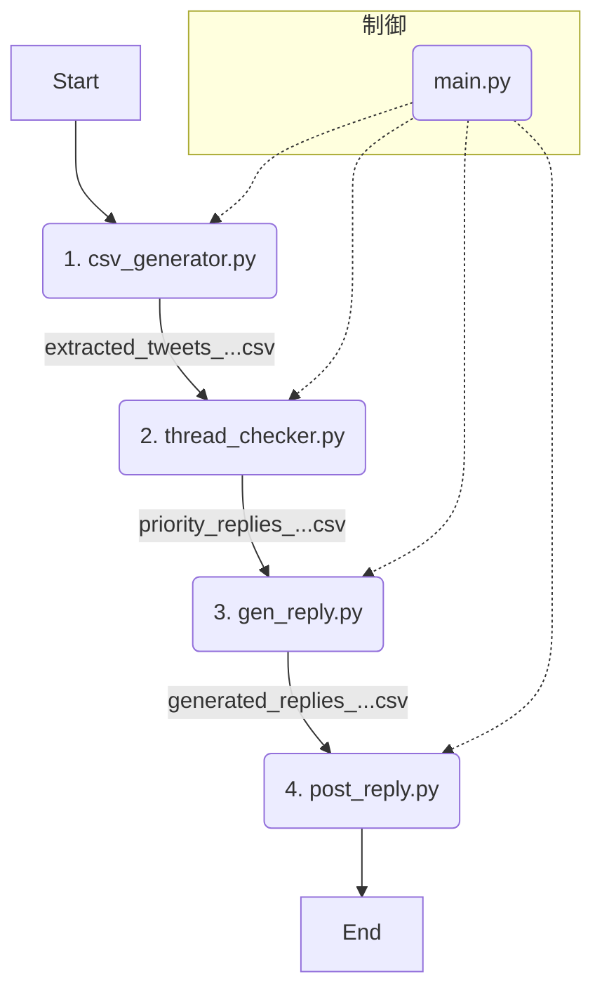

# Maya自動返信ボット 仕様書 (v2.0 - モジュール分割版)

## 1. 目的

本システムは、X（旧Twitter）上で「Maya（@Maya19960330）」アカウントに届いたメンション（リプライ）の中から、**自身の投稿を起点とするスレッドへの返信**を自動で特定し、AIによる返信文を生成、投稿準備までを行うことを目的とします。

## 2. システムアーキテクチャ

本システムは、複数の独立したPythonモジュールが、**CSVファイルを介して**順番に処理を受け渡すパイプラインアーキテクチャを採用しています。これにより、各ステップの責務が明確になり、デバッグや仕様変更が容易になります。



---

## 3. モジュール詳細

### ステップ1: リプライ収集 (`csv_generator.py`)

-   **入力**: なし
-   **処理**:
    -   Seleniumを起動し、Cookieを使ってXにログインします。
    -   通知ページ (`https://x.com/notifications/mentions`) にアクセスします。
    -   ページを複数回スクロールし、表示されるすべてのメンション（リプライ）のHTMLを取得します。
    -   取得したHTMLから、以下の情報を抽出します。
        -   リプライ自身のID (`reply_id`)
        -   リプライ投稿者のユーザーID (`user_id`) と名前 (`user_name`)
        -   リプライ本文 (`text`)
        -   投稿日時 (`created_at`)
-   **出力**: `output/extracted_tweets_{タイムスタンプ}.csv`
    -   上記で抽出した情報をまとめたCSVファイル。これがパイプラインの起点となります。

### ステップ2: スレッド起点判定 (`thread_checker.py`)

-   **入力**: `extracted_tweets_...csv`
-   **処理**:
    -   入力CSVの各行（各リプライ）について、そのリプライのURLにSeleniumでアクセスします。
    -   ページを解析し、会話スレッドの**一番大元の投稿者**のユーザーIDを特定します。
    -   特定した大元投稿者のIDが、`config.py`で設定された自分自身のID (`TARGET_USER`) と一致するかを判定します。
    -   判定結果を `is_my_thread` (True/False) という新しい列に追加します。
-   **出力**: `output/priority_replies_rechecked_{タイムスタンプ}.csv`
    -   `is_my_thread` 列が追加されたCSVファイル。

### ステップ3: 返信文生成 (`gen_reply.py`)

-   **入力**: `priority_replies_rechecked_...csv`
-   **処理**:
    -   `is_my_thread` が `True` のリプライのみを対象とします。
    -   対象リプライの本文と、`config.py` の `MAYA_PERSONALITY_PROMPT` を使用して、OpenAIのAPI (GPT-4o-mini) にリクエストを送信します。
    -   AIによって生成された返信文を取得し、`generated_reply` という新しい列に追加します。
-   **出力**: `output/generated_replies_{タイムスタンプ}.csv`
    -   `generated_reply` 列が追加されたCSVファイル。

### ステップ4: 投稿処理 (`post_reply.py`)

-   **入力**: `generated_replies_...csv`
-   **処理**:
    -   **ドライランモード (デフォルト)**:
        -   実際には投稿せず、「どのツイートに、どのような内容で返信し、いいねを押すか」という計画をログに出力するだけです。
    -   **ライブモード (`--live-run` フラグ指定時)**:
        -   **【注意】実際にXへの投稿が行われます。**
        -   CSVの各行について、Seleniumで対象ツイートページにアクセスします。
        -   ツイートに「いいね」をします。
        -   `generated_reply` 列のテキストを使って、返信を投稿します。
-   **出力**: なし (ログ出力のみ)

### 統括制御 (`main.py`)

-   **役割**: 上記のステップ1〜4のモジュールを順番に呼び出し、処理全体の流れを制御します。
-   **実行方法**: `python -m reply_bot.main` コマンドで実行します。
-   **処理フロー**:
    1.  `csv_generator.py` を実行し、出力されたCSVパスを取得します。
    2.  取得したパスを `thread_checker.py` に渡し、次のCSVパスを取得します。
    3.  取得したパスを `gen_reply.py` に渡し、さらに次のCSVパスを取得します。
    4.  最終的なCSVパスを `post_reply.py` に渡して実行します（常にドライランモード）。

---

## 4. 設定ファイル (`config.py`)

システムの動作に関わる各種設定をこのファイルで管理します。

-   `TARGET_USER`: 自分自身のXユーザーID (`@`なし)
-   `USERNAME`, `PASSWORD`: ログイン情報
-   `OPENAI_API_KEY`: OpenAIのAPIキー
-   `MAX_SCROLLS`: `csv_generator`での最大スクロール回数
-   `PRIORITY_REPLY_ENABLED`: `thread_checker`で、自分のスレッドへの返信を優先して件数を絞る機能のON/OFF
-   `MAYA_PERSONALITY_PROMPT`: `gen_reply`でAIに与える人格設定プロンプト

---

## 5. フォルダ構成

```
Twitter_reply/
├── reply_bot/
│   ├── main.py               # 統括制御
│   ├── csv_generator.py      # Step 1
│   ├── thread_checker.py     # Step 2
│   ├── gen_reply.py          # Step 3
│   ├── post_reply.py         # Step 4
│   ├── utils.py              # 共通関数 (WebDriverセットアップなど)
│   ├── config.py             # 設定ファイル
│   └── ...
├── cookie/
│   └── twitter_cookies_01.pkl # ログインセッション
├── output/                    # 各ステップのCSVが出力される (Git追跡対象外)
│   ├── extracted_tweets_...csv
│   ├── priority_replies_...csv
│   └── generated_replies_...csv
└── requirements.txt
```
