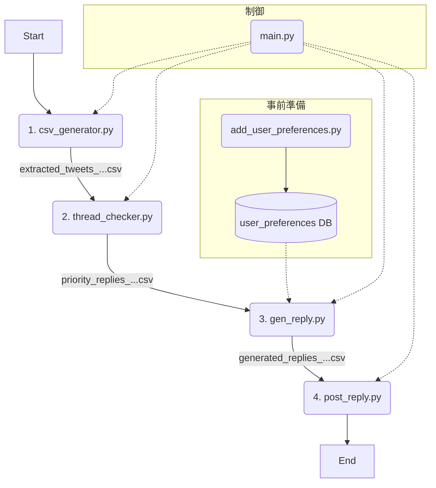

# Maya自動返信ボット 仕様書 (v3.0)

## 1. 目的

本システムは、X（旧Twitter）上で「Maya（@Maya19960330）」アカウントに届いたメンション（リプライ）の中から、**自身の投稿を起点とするスレッドへの返信**を自動で特定し、AIによる返信文を生成、投稿準備までを行うことを目的とします。

## 2. システムアーキテクチャ

本システムは、複数の独立したPythonモジュールが、**CSVファイルやSQLiteデータベースを介して**順番に処理を受け渡すパイプラインアーキテクチャを採用しています。



---

## 3. モジュール詳細

### ステップ0: ユーザー情報登録 (`add_user_preferences.py`)
-   **入力**: なし（スクリプト内で直接編集）
-   **処理**:
    -   特定のユーザー（友人など）のUserIDと、返信時に使用したいニックネーム、使用言語を`user_preferences`テーブルに登録します。
    -   このモジュールはパイプラインとは独立して、事前に手動で実行します。
-   **出力**: `replies.db`へのレコード追加

### ステップ1: リプライ収集 (`csv_generator.py`)

-   **入力**: なし
-   **処理**:
    -   Seleniumを起動し、Cookieを使ってXにログインします。
    -   最新の情報を確実に取得するため、一度ホームページを経由してから再度通知ページ (`https://x.com/notifications/mentions`) にアクセスします。
    -   表示されるメンションから情報を抽出します。
    -   抽出項目: `reply_id`, `user_id`, `user_name`, `text`, `created_at`, `lang`
-   **出力**: `output/extracted_tweets_{タイムスタンプ}.csv`

### ステップ2: スレッド起点判定 (`thread_checker.py`)

-   **入力**: `extracted_tweets_...csv`
-   **処理**:
    -   **`reply_num`が0のリプライのみを対象とし**、各リプライについてスレッドの大元の投稿者が自分自身 (`TARGET_USER`) かを判定します。
    -   判定結果を `is_my_thread` (True/False) 列に追加します。
-   **出力**: `output/priority_replies_rechecked_{タイムスタンプ}.csv`

### ステップ3: 返信文生成 (`gen_reply.py`)

-   **入力**: `priority_replies_rechecked_...csv`, `replies.db`
-   **処理**:
    -   **`is_my_thread` が `True` のリプライに対してのみ**、AIによる返信文を生成します。
    -   `is_my_thread` が `False` の場合は返信生成をスキップし、`generated_reply` 列を空欄のまま後続の処理に渡します。
    -   リプライ投稿者のUserIDをキーに`user_preferences`テーブルを検索し、ニックネームが存在するか確認します。
    -   **ニックネームがある場合**: プログラムで「{ニックネーム}\n」を先頭につけ、AIには呼びかけを含まない親しみやすい返信を生成させます。
    -   **ニックネームがない場合**: AIに呼びかけなしの短い返信を生成させます。
    -   AIモデルにはGoogleのGemini (`gemini-1.5-flash`) を使用します。
    -   **後処理の適用**: 生成されたテキストに対し、後処理を実行します。許可されていない絵文字やAI自身の名前などの不要語句を削除し、末尾に必ず🩷が1つだけ付くようにルールを強制します。
    -   最終的な返信文を `generated_reply` 列に追加します。
-   **出力**: `output/generated_replies_{タイムスタンプ}.csv`

### ステップ4: 投稿処理 (`post_reply.py`)

-   **入力**: `generated_replies_...csv`
-   **処理**:
    -   CSVファイルを読み込み、処理の進捗を管理するための`liked`列がなければ自動的に追加します。
    -   **ドライランモード (デフォルト)**:
        -   実際には投稿や「いいね」を行わず、計画のみをログに出力します。CSVファイルへの進捗書き込みも行いません。
    -   **ライブモード (`--live-run` フラグ指定時)**:
        -   **【注意】実際にXへの投稿が行われます。**
        -   各行について、Seleniumで対象ツイートページにアクセスします。
        -   **「いいね」処理**: CSV上で `liked` が `False` の場合に限り、「いいね」を実行し、成功すれば `liked` を `True` に更新します。これにより再実行時の重複「いいね」を防ぎます。
        -   **返信処理 (重複チェック)**:
            1. `is_my_thread` が `True` のツイートのみを返信候補とします。
            2. ページを開き、**返信対象のツイートよりも後（未来）に、別の誰かによる返信が1件でも存在するか**を動的にチェックします。
            3. 後続の返信が存在しない場合にのみ、`generated_reply` の内容で返信を投稿します。
            4. 後続の返信が見つかった場合は、会話への割り込みを防ぐため投稿をスキップし、次の処理へ即座に移行します（クールダウンなし）。
    -   各投稿処理後、連続投稿によるアカウントリスクを避けるため、設定された待機時間 (`POST_INTERVAL_SECONDS`) を設けます。
-   **出力**:
    -   ライブモードで「いいね」が行われた場合、更新された状態が入力元のCSVファイルに書き戻されます。

### 統括制御 (`main.py`)

-   **役割**: 上記のステップ1〜4のモジュールを順番に呼び出し、処理全体の流れを制御します。
-   **処理フロー**:
    1.  `csv_generator.py` を実行
    2.  `thread_checker.py` を実行
    3.  `gen_reply.py` を実行
    4.  `post_reply.py` を実行 (常にドライランモード)

---

## 4. 設定ファイルとデータベース

### 設定ファイル (`config.py`)
-   `TARGET_USER`: 自分自身のXユーザーID (`@`なし)
-   `USERNAME`, `PASSWORD`: ログイン情報
-   `GEMINI_API_KEY`: Google Gemini APIのキー
-   `MAX_SCROLLS`: `csv_generator`での最大スクロール回数
-   `MAYA_PERSONALITY_PROMPT`: **この設定は廃止されました。**プロンプトは現在 `reply_bot/gen_reply.py` スクリプト内で直接管理されています。

### データベース (`replies.db`)
-   **`user_preferences`テーブル**: ニックネームや言語など、ユーザーごとの設定を保存します。

---

## 5. フォルダ構成

```
Twitter_reply/
├── reply_bot/
│   ├── main.py
│   ├── csv_generator.py
│   ├── thread_checker.py
│   ├── gen_reply.py
│   ├── post_reply.py
│   ├── add_user_preferences.py
│   ├── utils.py
│   ├── config.py
│   └── replies.db              # ユーザー情報などを格納
├── cookie/
│   └── twitter_cookies_01.pkl
├── output/
│   └── (各種CSVファイル)
└── requirements.txt
```
